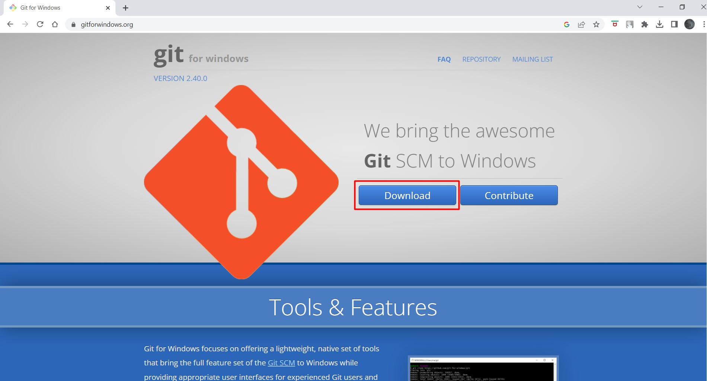

# Lab 1 Report
## CSE15L Account
First, you need to look up your course-specific CSE 15L account on this website:
[https://sdacs.ucsd.edu/~icc/index.php](https://sdacs.ucsd.edu/~icc/index.php):    
 
   
Under additional accounts you should click the one that starts with "cs15l":  
  
   
In the new window copy your username and click "Global Password Change Tool":  
  
   
Click "Proceed to the Password Change Tool".   
When you are asked to enter your username make sure to put your cs15l username you have just copied.       
Follow the instructions. After you click the "Finish password setup" button you are done with the password reset.       
It might take a few minutes to take effect.     

## Visual Studio Code
I had VScode installed on my laptop since I have been using it before this class (for CSE 8B).   
However, I will include the instructions on how I installed it (I am working on Windows).  
The link where it can be installed: [https://code.visualstudio.com/](https://code.visualstudio.com/).  
After opening the website you should click this:  
  
  
The window will pop up. You should click "Save"  
(but keep in mind where you are saving the file so you can easily find it. I am saving it on my Desktop):  
  
   
Open the installer you have just downloaded and follow the instructions.  
When it is installed you should be able to open this window:  
 

## Remotely Connecting
First, you need to install git. Here is the link for Windows: [https://gitforwindows.org/](https://gitforwindows.org/).  
After opening the link click download:  
 
  
The window will pop up, click "Save".  
Open the installer and follow the instructions.    
Then open VScode and open a new terminal:  
  
  
In the terminal type this command `$ ssh username@ieng6.ucsd.edu` where username is your cs15l username.  
(The dollar sign is used to indicate that what follows is a command, it should not be typed in.)  
Type in "yes" when asked if you are sure you want to connect.  
Then you will be asked for password. Type in the password you have created in the first step.   
You cannot see what are you typing in the command line for security reasons.  
After that you will see something like this:   
 

## Run Some Commands
Your terminal is now remotely connected to the server and you can run different commands.  
Here is a list of commands I tried:
* _cd ~_ (_cd_ - change directory, ~ - home directory)
* _cd_
* _ls -lat_ (_ls_ - list files and folders)
* _ls -a_
* _ls /home/linux/ieng6/cs15lsp23/cs15lsp23ly_ (cs15lsp23ly - username of one of my groupmates)  
* _cp /home/linux/ieng6/cs15lsp23/public/hello.txt ~/_
* _cat /home/linux/ieng6/cs15lsp23/public/hello.txt_ (_cat_ - print contents of files)  
  
The result:  
   
  
We can try other commands as well. For example, we can look up the absolute path to our current directory (_pwd_)  
or see the list of CSE15L students' usernames (_ls_):  
   
  
We don't have access to directories of other students (we get "Permission denied" message if we try to access them),  
but we can look up what is in the "public" directory and read one of the files with the _cat_ command:  
   
  
You can run the command _exit_ to log out of the remote server or create a new terminal and try the same commands on your own computer.  
My result:   
   
  
We get error messages since my computer has different files which are stored in the different way.  
We can try other commands on my computer:  
   
   
  
Thank you for reading! :cherry_blossom:

